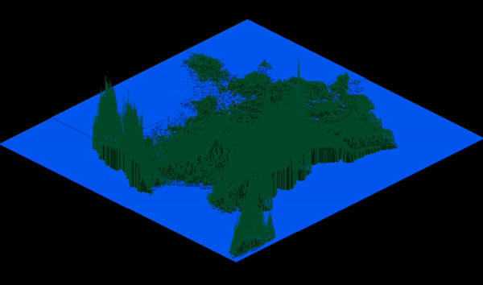
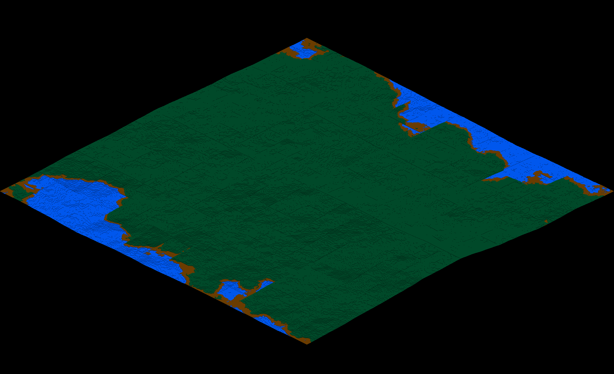
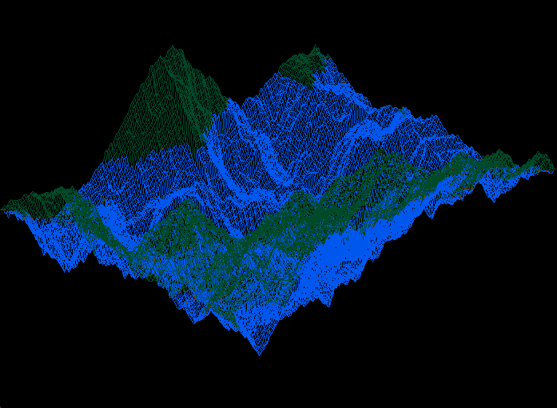
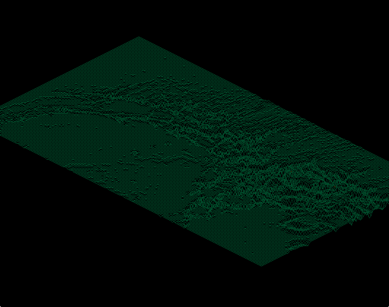

# Fdf
1rst project of [42 School](https://www.42.fr) Computer Graphics Branch.

## Description

Fdf is a program designed to view 2D topological maps in a 3D space.

## Features

- Move the 3D map along the X and Y axis
- Zoom in and zoom out
- Increase or decrease the depth factor
- Increase or decrease sea level
- Reinitiate the map

## Usage

```
$> make
$> ./fdf file.fdf
```
## Keys

<table width="100%">
<thead>
<tr>
<td width="40%" height="60px" align="center" cellpadding="0">
<strong>Description</strong>
</td>
<td width="10%" align="center" cellpadding="0">
<span style="width:70px">&nbsp;</span><strong>Key(s)</strong><span style="width:50px">&nbsp;</span>
</td>
</tr>
</thead>
<tbody>
<tr>
<td valign="top" height="30px">Exit the program</td>
<td valign="top" align="center"><kbd>&nbsp;esc&nbsp;</kbd></td>
</tr>
<tr>
<td valign="top" height="30px">Reinitiate the map</td>
<td valign="top" align="center"><kbd>&nbsp;return&nbsp;</kbd></td>
</tr>
<tr>
<td valign="top" height="30px">Move the map along X axis</td>
<td valign="top" align="center"><kbd>&nbsp;◄&nbsp;</kbd> <kbd>&nbsp;►&nbsp;</kbd></td>
</tr>
<tr>
<td valign="top" height="30px">Move the map along Y axis</td>
<td valign="top" align="center"><kbd>&nbsp;▲&nbsp;</kbd> <kbd>&nbsp;▼&nbsp;</kbd></td>
</tr>
<tr>
<td valign="top" height="30px">Zoom in/out</td>
<td valign="top" align="center"><kbd>&nbsp;p&nbsp;</kbd> <kbd>&nbsp;m&nbsp;</kbd></td>
</tr>
<td valign="top" height="30px">Translate camera/object along local Z axis</td>
<td valign="top" align="center"><kbd>&nbsp;h&nbsp;</kbd> <kbd>&nbsp;b&nbsp;</kbd></td>
</tr>
</tbody>
</table>

## Output examples
### France


### Map 1


### Map 2


### Mars

